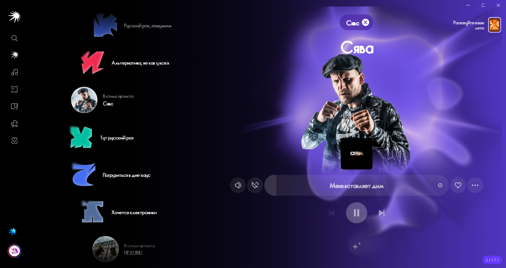

# Yandex Music Liberty Mod

Этот форк основан на оригинальных модах (YandexMusicBetaMod), но включает в себя **полностью независимую систему обхода цензуры (YM Liberty)** с собственной базой треков, ботом для заявок и **полноценной поддержкой Linux**.



## 🚀 Возможности и особенности

- **Независимая база без цензуры (YM Liberty)**: Автоматическая замена заглушенных треков на оригинальные (без цензуры). База полностью отвязана от сторонних серверов и работает через GitHub + Hugging Face.
- **Кроссплатформенность (Windows & Linux)**: Доступна как версия с установщиком для Windows, так и полноценный автономный Portable-билд для Linux x64.
- **Интеграция с Telegram**: Заявки на отсутствующие треки отправляются напрямую боту администратора через кнопку прямо в интерфейсе плеера.
- **Авто-обновление базы**: Мод подтягивает свежие треки каждые 30 секунд в фоне. Перезагрузка приложения после добавления нового трека больше не требуется!
- **Discord Rich Presence**: Отображение текущего трека и статуса в Discord.
- **Кастомные темы**: Выбор любых акцентных цветов (включая HEX и градиенты) в настройках мода.
- **Исправление ошибок**: Исправлена ошибка скачивания обновлений (405 Error), удалены назойливые ошибки 404 при обращении к локальным модулям.
- **Скачивание музыки**: Загрузка треков в форматах MP3 и FLAC (в Windows-версии).
- **Доступ к DevTools**: Встроенная консоль разработчика по нажатию F12.

---

## 📥 Установка и запуск

Готовые сборки для всех платформ находятся в разделе **[Releases](https://github.com/gagayhhad-tech/YandexMusicLiberty/releases)**.

### 🪟 Windows
1. Скачайте файл установщика (`Setup.5.117.1.exe` или `.exe` из релиза).
2. Запустите установку. Официальный клиент отдельно устанавливать не нужно — мод уже интегрирован.

### 🐧 Linux (x64)
1. Скачайте архив `yandex-music-liberty-linux.zip` из релиза.
2. Распакуйте архив в удобную папку:
   ```bash
   unzip yandex-music-liberty-linux.zip -d yandex-music-liberty
   cd yandex-music-liberty
   ```
3. Сделайте исполняемый файл запускаемым (если требуется) и запустите:
   ```bash
   chmod +x yandex-music-liberty
   ./yandex-music-liberty
   ```
> Приложение работает в портативном режиме на базе Electron и не требует установки в систему.

---

## 🛠 Сборка из исходников

Если вы хотите собрать проект самостоятельно:

1. Установите [Bun](https://bun.sh/).
2. Склонируйте репозиторий и установите зависимости:
   ```bash
   bun install
   ```
3. Запустите сборку:
   ```bash
   bun start
   ```

---

## 💖 Благодарности оригинальным авторам

Этот мод был бы невозможен без работы следующих людей:
- [**Stephanzion**](https://github.com/Stephanzion/YandexMusicBetaMod) — за создание оригинального патчера и React-модов.
- [**HoleverGG**](https://github.com/HoleverGG/YandexMusicBetaMod) — за адаптацию мода под новые версии клиента.
- [**Hazzz895**](https://github.com/Hazzz895/FckCensor) — за оригинальную идею системы обхода цензуры, которая легла в основу YM Liberty.

---

## 📄 Лицензия

Проект распространяется под лицензией [MIT](./LICENSE).

---

## ⚖️ Отказ от ответственности

Все права на торговые марки и интеллектуальную собственность принадлежат их законным владельцам. Этот мод создан исключительно в исследовательских и образовательных целях. Используя данный проект, вы берете на себя полную ответственность за любые возможные последствия.
